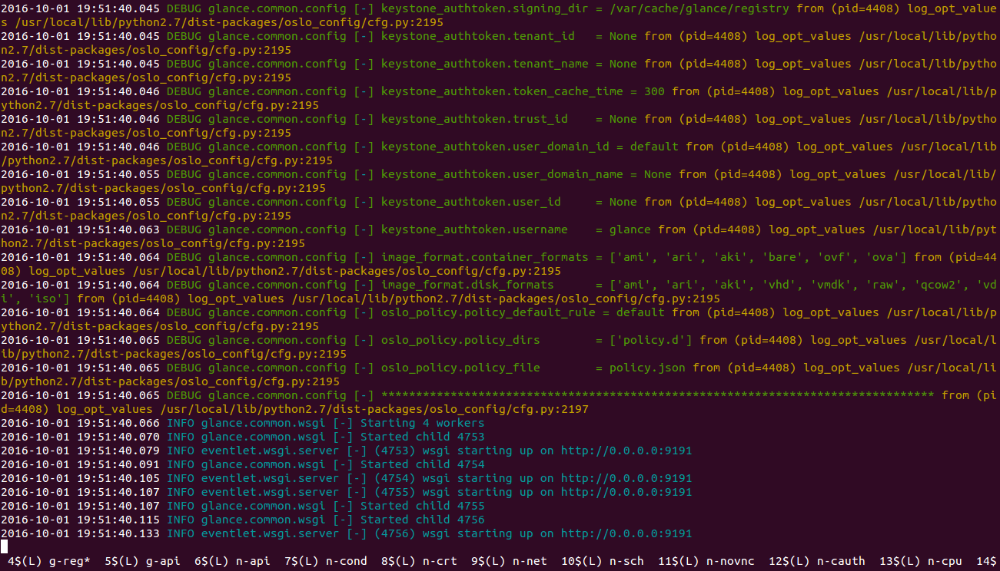
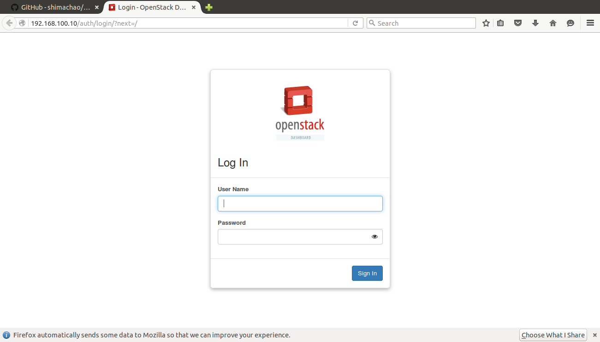
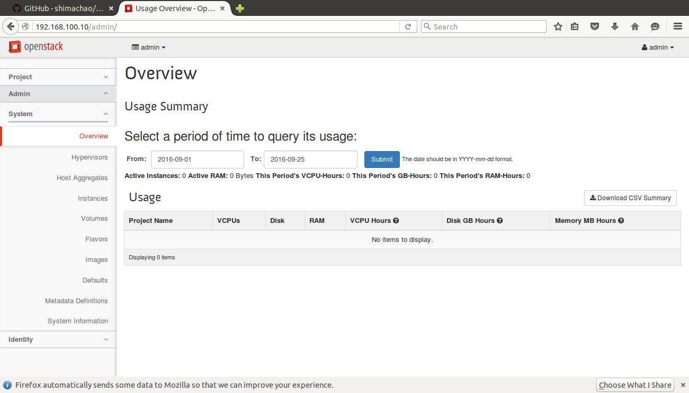
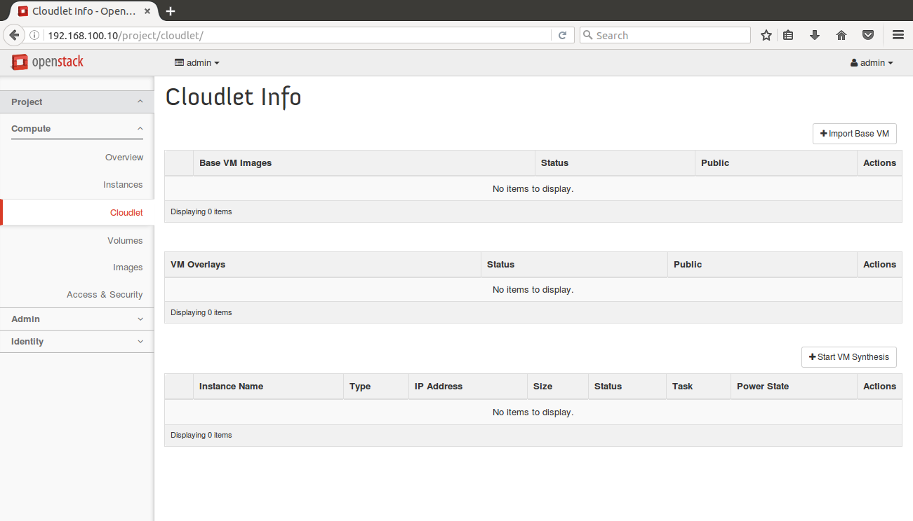

# 安装
安装 Cloudlet 需要先部署好 OpenStack，并在部署好的 OpenStack 上安装一个扩展。而部署 OpenStack 是一个复杂得过程，对电脑主机性能和网络环境都有一定的要求。

## 准备好硬件环境
搭建好 Cloudlet 测试环境，你需要准备一下环境
- 一个 U 盘或移动硬盘，供备份源码或配置文件用。
- 一台性能较好的电脑主机。
- 一个局域网环境，且局域网能连通外网。
- 将电脑主机连接到局域网中，并为其分配固定的 IP 地址。
- 在局域网内预留一段 IP 地址给供后面测试用。

电脑主机最好 4G 以上内存、多核 CPU、固态硬盘、两块网卡。本人在一台 4G 内存的 ThinkPad E40 笔记本上安装好 OpenStack 后，刚运行起来就卡死了。所以内存必须得 4G 以上。固态硬盘是为了加快安装系统和软件的速度。至于双网卡是为了后面网络设置方便。只有一张网卡也行。

## 准备好操作系统
在电脑主机上安装好 Ubuntu 14.04 LTS x64，可以是桌面版，也可以是服务器版，本人安装的是桌面版。Cloudlet 依赖于 Ubuntu 提供的一些软件包，所以必须在 Ubuntu 上安装。而且原作者只在 Ubuntu 14.04 x64 上做了测试。

## 准备好软件环境
1. 替换 Ubuntu 软件源

由于安装过程中需要到 Ubuntu 软件仓库下载大量的软件包，Ubuntu 系统默认的官方软件源在国外，往往会因为网速问题而导致失败。所以我们可以将 Ubuntu 的软件源替换为国内源。如果你所在的局域网环境搭建好了自己的 Ubuntu 源就更好了。我所在的环境离西电开源社区的软件源更近，所以下面以西电开源社区的源为例来说明。
编辑 /etc/apt/sources.list
```shell
$ sudo gedit /etc/apt/sources.list
```
将 /etc/apt/sources.list 中的内容替换为下面的西电开源社区的源地址：
```
deb http://ftp.xdlinux.info/ubuntu/ trusty main restricted universe multiverse
deb http://ftp.xdlinux.info/ubuntu/ trusty-security main restricted universe multiverse
deb http://ftp.xdlinux.info/ubuntu/ trusty-updates main restricted universe multiverse
deb http://ftp.xdlinux.info/ubuntu/ trusty-proposed main restricted universe multiverse
deb http://ftp.xdlinux.info/ubuntu/ trusty-backports main restricted universe multiverse
deb-src http://ftp.xdlinux.info/ubuntu/ trusty main restricted universe multiverse
deb-src http://ftp.xdlinux.info/ubuntu/ trusty-security main restricted universe multiverse
deb-src http://ftp.xdlinux.info/ubuntu/ trusty-updates main restricted universe multiverse
deb-src http://ftp.xdlinux.info/ubuntu/ trusty-proposed main restricted universe multiverse
deb-src http://ftp.xdlinux.info/ubuntu/ trusty-backports main restricted universe multiverse
```
这里仅以西电开源社区的源为例，你也可以选择清华大学的软件源、163源、阿里源等国内源。

2. 同步软件源并更新系统

```
$ sudo apt-get update
$ sudo apt-get -y upgrade
```

3. 修改 pip 源

OpenStack 安装过程中同样会下载大量 Python 包，同样由于网络问题，我们需要将 Python 的 pip 源替换为国内源。如果你所在的网络环境有自己的 pip 源就更好了。如果你在清华就使用清华的 pip 源，如果你在中科大就使用中科大的 pip 源。没有就建议使用豆瓣的 pip 源。我所在的环境没有好的 pip 源，所以就选择了豆瓣的 pip 源。下面是豆瓣的 pip 源为例说。
```shell
$ cd ~
$ mkdir .pip
$ gedit .pip/pip.conf
```
在 .pip/pip.conf 中填入下面的豆瓣源地址：
```
[global]
timeout = 60
index-url = http://pypi.douban.com/simple
[install]
trusted-host = pypi.douban.com
```

4. 安装或升级必要的软件包

```
$ sudo apt-get -y install python-pip python3-pip python-setuptools python3-setuptools git vim openssh-server fabric dos2unix
```
升级 pip
```shell
$ sudo pip install --upgrade pip
$ sudo pip3 install --upgrade pip
$ sudo pip install --upgrade os-testr
```
安装必要的 Python 包
```shell
$ sudo pip install pyopenssl ndg-httpsclient pyasn1
```
以上这些软件包大多是 Cloudlet 文档要求的，还有一些是本人多次安装过程中遇到错误总结出来的。

## 下载 Cloudlet 和 OpenStack 软件源码并备份
### 下载
```shell
$ cd ~
$ git clone https://github.com/cmusatyalab/elijah-provisioning
$ git clone -b stable/kilo https://github.com/openstack-dev/devstack
$ git clone https://github.com/cmusatyalab/elijah-openstack
```
本人将上面上个源码仓库备份到国内网站上。如果以上下载地址失效或网速有问题，你也可以到本人下面的备份地址下载：
```shell
$ cd ~
$ git clone https://git.oschina.net/shimachao/elijah-provisioning.git
$ git clone -b stable/kilo https://git.oschina.net/shimachao/devstack.git
$ git clone https://git.oschina.net/shimachao/elijah-openstack.git
```
第一个 elijah-provisioning 源码仓库包含和 BaseVM 相关的一些工具和 Cloudlet 用到的库。

第二个 devstack 源码仓库是用于部署 OpenStack 环境的工具。

第三个 elijah-openstack 源码仓库是针对 OpenStack 的 Cloudlet 扩展。

### 备份

由于 OpenStack 可能会安装失败，你可能会多次重装，所以建议你将上面下载的源码仓库备份起来，方便后面重装时使用。假设你的外接存储介质（U 盘或移动硬盘）在系统上的挂载路径为 /path/to/you/u，在存储介质上创建一个目录 cloudlet_backup。开始备份。
```shell
$ cd /path/to/you/u/cloudlet_backup/
$ git clone ~/elijah-provisioning
$ git clone ~/devstack
$ git clone ~/elijah-openstack
```
以后重装时就不需要从网上下载源码包了，直接从外接存储介质中备份目录 git clone 就行。

## 安装 elijah-provisioning
现在开始正式的安装过程。在安装 elijah-provisioning，我们需要修改一下安装脚本来加快安装速度，增加安装的成功率。一下工作都在 elijah-provisioning 目录下进行。

### 修改 fabfile.py 脚本
```shell
$ cd ~
$ cd elijah-provisioning
$ gedit fabfile.py
```
将 fabfile.py 文件中的第 93~95 行、98 行注释掉。这几行是用 wget 命令下载一个安装包，但这个下载过程特别漫长，很容易因为超时出错。所以我们将其注释掉，改为手动下载。复杂第 93 行的链接地址，粘贴到流浪器中，将得到一个下载文件。将这个下载到的文件重命名为 python-xdelta3.deb，保存到 ~/elijah-provisioning 目录下面。建议你将这个文件备份一下，万一重装的时候可以再使用。

### 修改 setup.py 脚本
```shell
$ gedit setup.py
```
将 setup.py 的第 48 行注释掉。这一行是在下载一个镜像文件，但速度特别慢，容易出错，所以我们将其改为手动下载。复制第 35 行代码中的链接地址，粘贴到浏览器中下载。将得到一个名为 qemu-system-x86\_64 的文件。将其改名为 cloudlet\_qemu-system-x86\_64，复制到目录 ~/elijah-provisioning/elijah/provisioning/lib/bin/x86-64/ 下面。同样建议将此文件备份一下。

### 运行安装脚本
```shell
$ cd ~
$ cd elijah-provisioning
$ fab install
```

### 验证
```shell
 $ cloudlet list-base
```
如果输出 hash value、path 类似的字眼，说明安装成功。如果提示未找到相应的命令行，说明安装失败，请重新安装。

## 安装 OpenStack
OpenStack 的安装是整个过程中最复杂的一步。必须的严格按照步骤来。

### 修改安装脚本
```shell
 $ cd ~
 $ cd devstack
 $ git checkout stable/kilo
 $ gedit tools/install_pip.sh
```
将 tools/install_pip.sh 文件中的第 97 行、99 行、105 行注释掉。这几行是在升级 pip，速度特别慢，通常会出现超时错误，所以我们将其注释掉。而且 升级 pip 的事我们已经在前面的准备工作中做过了。

### 手动下载 OpenStack 各个组件的源码包
虽然 DevStack 提供的安装脚本会自动下载 OpenStack 各个组件的源码包，但下载速度比较慢，我们手动下载并备份，以免以后重复下载。
1. 创建目录

DevStack 会默认将下载到的 OpenStack 源码包放在 /opt/stack 目录下。这里我们手动下载，所以需要自己手动创建目录。
```shell
$ cd /opt
$ sudo mkdir stack
$ chmod 755 stack
$ ls -l
total 4
drwxr-xr-x 2 root root 4096 10月  1 09:35 stack
```
上面的命令创建了 /opt/stack 目录，并修改目录的权限，确保你的输出和上面类似。

2. 下载 OpenStack 各个组件的源码包

由于我们需要安装 OpenStack 的 kilo 版本，而官方代码仓库里已经删除了 kilo 分支的代码。所幸我们在国内的 CSDN 网站提供的代码托管平台上找到了 kilo 版本的代码。下面我们将从 code.csdn.net 下载源码。-b stable/kilo 表示我们要下载的是 kilo 分支的代码。
```shell
$ cd stack/
$ git clone -b stable/kilo https://code.csdn.net/openstack/nova.git
$ git clone -b stable/kilo https://code.csdn.net/openstack/cinder.git
$ git clone -b stable/kilo https://code.csdn.net/openstack/glance.git
$ git clone -b stable/kilo https://code.csdn.net/openstack/horizon.git
$ git clone -b stable/kilo https://code.csdn.net/openstack/neutron.git
$ git clone -b stable/kilo https://code.csdn.net/openstack/keystone.git
$ git clone -b stable/kilo https://code.csdn.net/openstack/requirements.git
```
除了 OpenStack 的源码，我们还需要下载一个 noVNC 的源码，用于在浏览器中访问虚拟机的界面。
```shell
$ git clone http://git.trystack.cn/kanaka/noVNC.git
```
按照下面的步骤下载完所有的源码后，同样建议将所有的源码备份一下。

### 准备 DevStack 安装脚本的配置文件
我们现在需要准备 DevStack 安装所使用的配置文件。这一步尤为重要，安装失败多半是这里出问题。
在 devstack 目录下创建一个 local.conf 文件，在里面填入配置信息。
```shell
$ cd ~/devstack/
$ gedit local.conf
```
在 local.conf 文件中填入以下内容，然后根据你的实际情况修改。
```shell
[[local|localrc]]
SERVICE_TOKEN=abcdefg
ADMIN_PASSWORD=pass
MYSQL_PASSWORD=pass
RABBIT_PASSWORD=pass
SERVICE_PASSWORD=$ADMIN_PASSWORD

HOST_IP=192.168.100.12
SERVICE_HOST=192.168.100.12
MYSQL_HOST=192.168.100.12
RABBIT_HOST=192.168.100.12
GLANCE_HOSTPORT=192.168.100.12:9292

LOGFILE=$DEST/logs/stack.sh.log

LOGDAYS=2

SWIFT_HASH=66a3d6b56c1f479c8b4e70ab5c2000f5

SWIFT_REPLICAS=1

SWIFT_DATA_DIR=$DEST/data

disable_service n-net
enable_service q-svc
enable_service q-agt
enable_service q-dhcp
enable_service q-l3
enable_service q-meta
enable_service neutron
enable_service n-novnc
enable_service n-cauth
enable_service q-metering
#enable_service q-lbaas
#enable_service q-fwaas

disable_service tempest

#Neutron options
Q_USE_SECGROUP=True
Q_L3_ENABLED=True
FLOATING_RANGE="192.168.100.0/24"
FIXED_RANGE="10.0.0.0/24"
Q_FLOATING_ALLOCATION_POOL=start=192.168.100.200,end=192.168.100.254
PUBLIC_NETWORK_GATEWAY="192.168.100.1"
PUBLIC_INTERFACE=eth0

#Open vSwitch provider networking configuration
Q_USE_PROVIDERNET_FOR_PUBLIC=True
OVS_PHYSICAL_BRIDGE=br-ex
PUBLIC_BRIDGE=br-ex
OVS_BRIDGE_MAPPINGS=public:br-ex

#VLAN configuration
Q_PLUGIN=ml2
ENABLE_TENANT_VLANS=True

GIT_BASE=https://code.csdn.net
NOVNC_REPO=http://git.trystack.cn/kanaka/noVNC.git
SPICE_REPO=http://git.trystack.cn/git/spice/spice-html5.git

#OFFLINE=True
```
### 配置文件内容说明
接下来依次说明以上内容的意义。没提到的内容保持原样就行。
#### 密码
>ADMIN_PASSWORD=pass  
>MYSQL_PASSWORD=pass  
>RABBIT_PASSWORD=pass  
>SERVICE_PASSWORD=$ADMIN_PASSWORD  

这几个是密码设置，DevStack 在安装成功后会创建两个用户，用户的登录密码就是这里的密码。这里我将它简单的设为 pass，你可以改成自己想要设置。
#### IP
>HOST_IP=192.168.100.12  
>SERVICE_HOST=192.168.100.12  
>MYSQL_HOST=192.168.100.12  
>RABBIT_HOST=192.168.100.12  
>GLANCE_HOSTPORT=192.168.100.12:9292  

这里主机 IP 设置，和各个服务的 IP 设置。我安装时的主机 IP 为 192.168.100.12，所以我填的是 192.168.100.12。你必须都将其改成你在局域网中为主机所分配的 IP 就行（前面准备工作中让你给电脑主机分配一个固定的 IP 地址正是此意）。

 #### 固定 IP 和浮动 IP
>FLOATING_RANGE="192.168.100.0/24"  
>FIXED_RANGE="10.0.0.0/24"  
>Q_FLOATING_ALLOCATION_POOL=start=192.168.100.200,end=192.168.100.254  
>PUBLIC_NETWORK_GATEWAY="192.168.100.1"  
>PUBLIC_INTERFACE=eth0

OpenStack 中的固定 IP 是分配给虚拟机的私网 IP，只能用于虚拟机所在的私网使用，从虚拟机启动到关机一直不变。浮动 IP 是动态分配的，虚拟机用来访问外网所使用。

**FLOATING\_RANGE** 用于设置浮动 IP 的网段，设置为你主机所在局域网的网段。比如我安装时主机所在的网段为 192.168.100.0/24。

**Q\_FLOATING\_ALLOCATION\_POOL** 是分配给虚拟机的浮动 IP 范围。在前面的准备工作中我们在局域网中预留一段 IP 范围给虚拟机，填到这里就行。比如我预留的浮动 IP 段为 192.168.100.200~192.168.100.254。

**FIXED_RANGE** 是虚拟机固定 IP 的网段。设为 10.0.0.0/24 就行。

**PUBLIC\_NETWORK\_GATEWAY** 是默认网关，即主机所在局域网的网关地址，通常是你主机所连接到的路由器或交换机的 IP 地址。比如本人主机连接到的路由器 IP 地址为 192.168.100.1，所以我将其设置为 192.168.100.1。如果你的路由器或交换机的 IP 地址为 192.168.100.2，你就将其设为 192.168.100.3。

**PUBLIC_INTERFACE** 是主机连接所在局域网时所使用的网卡，这里我使用的是 eth0。

#### 组件源码地址
>GIT_BASE=https://code.csdn.net  
>NOVNC_REPO=http://git.trystack.cn/kanaka/noVNC.git  
>SPICE_REPO=http://git.trystack.cn/git/spice/spice-html5.git

**GIT_BASE** 是 DevStack 下载 OpenStack 各组件源码的地址。虽然我们已经手动下载了各组件的源码，但为了以防还要下载其他源码，这里将下载地址设为国内的镜像地址。

**NOVNC\_REPO** 是 noVNC 源码地址。

**SPICE\_REPO** 是 Horizon 组件所使用到的 spice 。

#### OFFLINE
> \#OFFLINE=True

**OFFLINE** 用于设置离线模式。未完成安装之前将其注释掉就行。在安装完成后，如果你修改了配置，重新运行安装脚本时将 OFFLINE=True 前面的注释去掉，可以避免重复从网上下载已有的东西。

### 运行安装脚本
到这里，我们已经准备好了 local.conf 文件。开始正式安装。
在安装之前务必要确认当前终端命令行所在的目录为 ~/devstack/，且网络畅通。
```shell
$ cd ~/devstack/
$ echo "$USER ALL=(ALL) NOPASSWD: ALL" | sudo tee -a /etc/sudoers
$ ./stack.sh
```
安装过程中会输出大量的日志信息。可以根据日志信息判断哪个阶段出了问题。如果顺利，最后会输出两个用户账号和密码。类似如下：
```
This is your host ip: 192.168.100.10
Horizon is now available at http://192.168.100.10/
Keystone is serving at http://192.168.100.10:5000/
The default users are: admin and demo
The password: pass
```
可以看到，创建了两个账户 admin 和 demo，密码就是我们之前在 local.conf 配置文件中设置的密码。

### 安装后的验证

#### stack 会话

通过 DevStack 部署好 OpenStack后，DevStack 会创建一个名为stack的 screen 会话，将 OpenStack 所有的服务进程放到该会话中管理。下面我们来验证一下这个会话。

```shell
$ screen -ls
There is a screen on:
	4215.stack	(2016年9月30日 19时51分26秒)	(Detached)
1 Socket in /var/run/screen/S-chao.
```

可以看出 DevStack 创建了一个名为 stack 的 screen 会话。我们在看看具体的 stack 会话.

```shell
$ screen -r stack
```



#### Web 界面
OpenStack 可以通过 Web 界面来访问和管理。我们打开看一下。

打开浏览器，在地址栏输入主机 IP 地址，然后点回车。会出现 OpenStack 的登录界面。


输入用户名和密码（前面安装脚本的输出）。点击 **Sign in**。出现如下界面：


如果你的验证结果和上面的一样，说明 OpenStack 已安装成功。


## 安装 Cloudlet 扩展
### 运行安装脚本
安装好 OpenStack 后就可以安装 Cloudlet 扩展了。
```shell
$ cd ~/elijah-openstack
$ fab localhost devstack_single_machine
```
输入用户密码，开始安装。

安装完成后的输出如下所示：
```
[localhost] sudo: sed -i '/instances/ s/$/ "cloudlet",/' /opt/stack/horizon/openstack_dashboard/dashboards/project/dashboard.py
[localhost] sudo: service apache2 restart
[SUCCESS] Finished installation
You should restart DevStack to activate changes!!
  1. Terminate using unstack.sh
  2. Restart using rejoin-stack.sh

Done.
Disconnecting from localhost... done.
```

### 重启 OpenStack
Cloudlet 扩展安装完成后需要重启 OpenStack 才会生效。
```shell
$ cd ~/devstack/
$ ./unstack.sh
$ ./rejoin-stack.sh
```
unstack.sh 会停止所有和 OpenStack 相关的服务进程。rejoin-stack.sh 则会重新启动它们。
根据我的经验，你还需要另开两个终端重启 apache2 和 keystone-all 服务
```shell
$ service apache2 start
$ keystone-all
```

### 验证
#### 检查 OpenStack 的状态
```
$ sudo nova-manage service list
Binary           Host                                 Zone             Status     State Updated_At
nova-conductor   chao-Y470                            internal         enabled    :-)   2016-09-25 12:41:07
nova-cert        chao-Y470                            internal         enabled    :-)   2016-09-25 12:41:07
nova-network     chao-Y470                            internal         enabled    :-)   2016-09-25 12:41:08
nova-scheduler   chao-Y470                            internal         enabled    :-)   2016-09-25 12:41:07
nova-consoleauth chao-Y470                            internal         enabled    :-)   2016-09-25 12:41:06
nova-compute     chao-Y470                            nova             enabled    :-)   2016-09-25 12:41:08
```
根据输出信息，如果哪个服务没有启动，可以到 名为 stack 的 screen 会话查看对应的日志信息。

#### 检查 Cloudlet 扩展是否安装成功
再次打开浏览器，在地址栏输入本机 IP，回车。在弹出的 OpenStack 页面中输入账号和密码，登录。点击页面左侧的 project 面板，你将看到一个 Cloudlet 选项。如下图所示。


至此，我们的整个安装总算完成了。

# 制作 Base VM 和 VM overlay
前面安装的 elijah-provisioning 提供了制作 base VM 和 VM overlay 的工具。我们可以用来制作自己的 base VM 和 VM overlay。由于原作者提供的验证程序运行在 Ubuntu-12.04.1-i386-Server 系统上，我们就以 Ubuntu-12.04.1-i386-Server 系统为例来制作一个 base VM。并以原作者提供的流体模拟程序为例，制作一个 VM overlay。

## 制作 Base VM
### 1. 创建磁盘镜像
制作 base VM 之前，我们需要一个已经安装好系统的磁盘镜像。
```shell
$ qemu-img create -f raw ubuntu12.04.img 8G
```
Cloudlet 提供的制作 base VM 和 VM overlay 的工具只支持 raw 镜像格式。所以我们创建了一个 8G 的 raw 格式镜像文件。

### 2. 安装系统
```shell
$ qemu-system-i386 -m 2048 --enable-kvm -had ./ubuntu12.04.img -cdrom ./ubuntu-12.04.1-server-i386.iso
```
运行这条命令会弹出一个对话框，在里面完成系统的安装。注意安装过程中有一步需要选择要安装的软件包，一定要把 OpenSSH server 选上。

### 3. 制作 Base VM
利用刚才制作的虚拟磁盘镜像，开始制作 base VM。
```shell
$ cloudlet base ./ubuntu12.04.img
```
该命令会弹出一个窗口，启动磁盘镜像里的系统。你可以在里面完成一些你认为必要的操作（你认为可以保留到 base VM 里面的状态），然后关闭该窗口。在你关闭窗口后，制作 base VM 的过程才正式开始，cloudlet base 会将刚才启动的系统里面的状态（包括磁盘和内存状态）快照并保存下来。这个过程可能需要一段时间，请耐心等待。
完成后的输出如下。
```
100%INFO     Finish Base VM Disk hashing
Base VM is created from ubuntu12.04.img
Disk: /home/chao/12.04test/ubuntu12.04.img
Mem: /home/chao/12.04test/ubuntu12.04.base-mem
```
可以在当前目录下看到，cloudlet base 命令创建的四个文件。
```
$ ls
ubuntu12.04.base-hash      ubuntu12.04.base-mem       ubuntu12.04.img
ubuntu12.04.base-img-meta  ubuntu12.04.base-mem-meta  ubuntu12.04.zip
```

### 4. 导出 Base VM
```shell
$ cloudlet export-base ./ubuntu12.04.img ubuntu12.04
INFO     Start compressing
INFO     zip -j -9 ./ubuntu12.04.zip ubuntu12.04.img ubuntu12.04.base-mem ubuntu12.04.base-img-meta ubuntu12.04.base-mem-meta
  adding: ubuntu12.04.img (deflated 97%)
  adding: ubuntu12.04.base-mem (deflated 95%)
  adding: ubuntu12.04.base-img-meta (deflated 13%)
  adding: ubuntu12.04.base-mem-meta (deflated 84%)
$ ls
ubuntu12.04.base-hash      ubuntu12.04.base-mem       ubuntu12.04.img
ubuntu12.04.base-img-meta  ubuntu12.04.base-mem-meta  ubuntu12.04.zip
```
根据该命令输出，我们可以看到生成了一个 ubuntu12.04.zip 文件，该文件就代表我们制作的 base VM，可用于导入到其他平台使用。后面我们使用 OpenStack 的 Cloudlet 扩展做实验时会用到该 zip 文件。

## 制作 VM overlay
现在在之前 base VM 的基础上制作 overlay。
### 1. 开始制作
```shell
$ cloudlet overlay ./ubuntu12.04.img -- -redir tcp:2222:22 -redir tcp:9093::9093
```
该命令会再次启动磁盘镜像并弹出虚拟机窗口，我们在其中做完必要的操作后关闭窗口，制作 VM overlay 的过程就开始了。-redir tcp:2222::22 表示把宿主机的 TCP 2222号端口z转发到虚拟机的 TCP 22 号端口。因为我们要用 ssh 命令远程登录虚拟机，并安装流体模拟程序。而虚拟机上 SSH 服务监听的端口正是22号端口，所以将宿主机的2222号端口转发为虚拟机的22号端口。另外流体模拟程序需要监听9093号端口，所以我们也将宿主机的9093号端口转发为虚拟机的9093号端口，便于流体模拟程序连接。

### 2. 在虚拟机中安装程序
#### 2.1 __传输安装程序包到虚拟机中__

在宿主机中通过 scp 命令将流体模拟程序传输到虚拟机中。
```shell
$ scp -P 2222 -r ~/fluid-bin32 chao@127.0.0.1:~/
```
#### 2.2 __安装__

以下操作在虚拟机窗口中完成。
```shell
# 安装
~$ ls
fluid-bin32
~$ cd fluid-bin32/
/fluid-bin32$ ls
CREDITS  cloudlet_test  lib-download  libn7physics.so
README   install        libn7core.so
~/fluid-bin32$ ls -l
total 1456
-rw-r--r-- 1 chao chao     143 Oct  4 16:09 CREDITS
-rw-r--r-- 1 chao chao    1127 Oct  4 16:09 README
-rwxr-xr-x 1 chao chao   39106 Oct  4 16:09 cloudlet_test
-rwxr-xr-x 1 chao chao     113 Oct  4 16:09 install
drwx------ 2 chao chao    4096 Oct  4 16:09 lib-download
-rw-r--r-- 1 chao chao  225570 Oct  4 16:09 libn7core.so
-rw-r--r-- 1 chao chao 1204106 Oct  4 16:09 libn7physics.so
~/fluid-bin32$ ./install 
[sudo] password for chao: 
Selecting previously unselected package libgomp1.
(Reading database ... 26373 files and directories currently installed.)
Unpacking libgomp1 (from libgomp1_4.6.3-1ubuntu5_i386.deb) ...
Setting up libgomp1 (4.6.3-1ubuntu5) ...
Processing triggers for libc-bin ...
ldconfig deferred processing now taking place
# 将当前目录路径添加到 /etc/ld.so.conf 最后一行
# ...
# 删除不需要的文件
~/fluid-bin32$ sudo rm CREDITS README install
~/fluid-bin32$ sudo rm -rf lib-download
```
### 3. __在虚拟机中启动程序__
接着上面的操作
```shell
$ ./cloudlet_test
```
程序便启动起来了。

### 4. 完成
这时关闭虚拟机窗口。制作 VM overlay 的过程便正式开始了。
过一段时间后会看到如下输出。
```
meta)
DEBUG    Overlay Compression time: 2.791376, delta_item: 11466
DEBUG    Total Overlay Size : 6064072
INFO     close Stream monitoring thread
INFO     Fuse close pipe
INFO     NO chunks has been waited at FUSE
INFO     close Fuse Exec thread
INFO     close File monitoring thread
meta file : (56261) bytes
blob file : (6064072) bytes (overlay-blob_1.xz)
zip overhead : (251) bytes
overlay file at : /tmp/cloudlet-overlay-nTCqNQ/overlay.zip
```
可以看到生成的 overlay 文件保存在 /tmp/cloudlet-overlay-nTCqNQ/overlay.zip。前面生成的 ubuntu12.04.zip 文件和这个 overlay.zip 文件就是我们要的 base VM 和 VM overlay，必须保存好，后面实验要用。